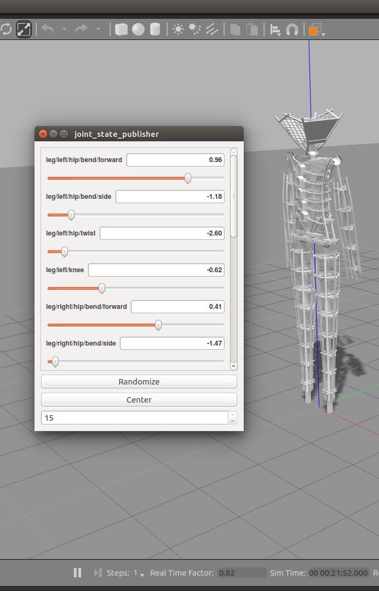
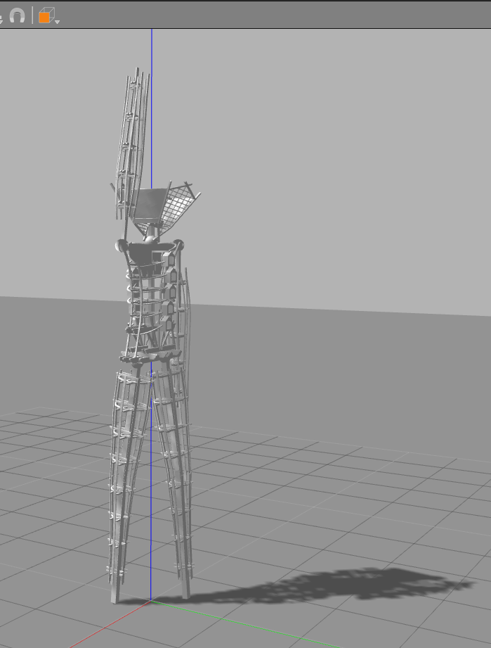

# public-API
For the public to interface with and contribute to iAwake

### Welcome creators!!

**This page is currently only a placeholder, soon these tutorials will be published to the official github / wiki.**

## What's this all about?
Last year the Tree of Tenere published a software model that people could hack content on.  This content was then directly runable on the Tree on playa, and lots of great content was generated from all over the world.

We're creating a similar paradeigm here with the ROS software model / simulator.  The idea is to create a shared interface that can be coded to to create content from the comfort of your laptop.  This content will then be directly runnable on the MiniMan at the hackathons, and on the Tall Man at the Burn!!

## Tutorials / Instruction

Follow the instructions in the README.md

At first in gazebo you should see.

After running the
`rosrun humanoid humanoid_node.py`
command you should see...

